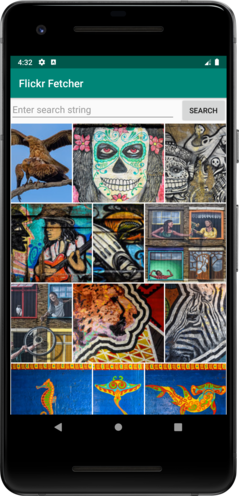
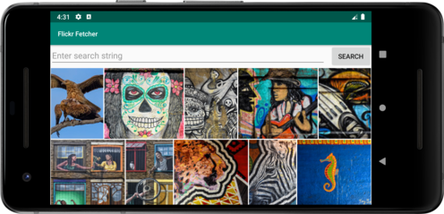

# Flickr Fetcher for Android (Using LiveData, ViewModel, Room and MVVM)

This is a sample project that fetches pictures from Flickr. This project has been developed using MVVM architecture.

## Components used
* [LiveData](https://developer.android.com/topic/libraries/architecture/livedata)
* [ViewModel](https://developer.android.com/topic/libraries/architecture/viewmodel)
* [Room Database](https://developer.android.com/topic/libraries/architecture/room)
* [Flexbox for Android](https://github.com/google/flexbox-layout)
* [Retrofit](https://square.github.io/retrofit)
* [Glide](https://github.com/bumptech/glide)
* [Stetho](https://github.com/facebook/stetho)

## Before you start
Please generate API Token from the [flickr developer website](https://www.flickr.com/services/api/) and add it in file **MainRepo.java** like below:
```java
private static final String API_KEY = "ADD_API_TOKEN_HERE";
```
Without this step, the app will **NOT WORK** 
## Working
The whole application is divided into the following major parts:

**UI Layer**
---
On launch, the app loads a default set of photos. You can also enter a search string manually to fetch photos from Flickr
based on the query entered.

**ViewModel - Data fetching logic**
---
Whenever a new set of photos is required, the app first queries the local database to get already saved photo URLs.
If an empty set is returned, a network call is made to fetch new photos from Flickr.
This way, the app can even work offline making use of already saved URLs and Glide's caching facility

**Network Layer**
---
Whenever new set of photos are required, a network request is made to fetch photos from Flickr using the search string provided.
When a successful response is received, the URLs are saved into the database

**Database Layer**
---
The app maintains a very simple Database containing storing the fetched photo URLs. Room library is used to maintain the database.
LiveData along with Room is used to inform the ViewModel whenver new insertions are made in the db. This way the UI layer is
easily refreshed whenever a response is received.

## Screenshots
---



## License
---
Copyright 2019 Manpreet Singh Anand

Licensed under the Apache License, Version 2.0 (the "License");
you may not use this file except in compliance with the License.
You may obtain a copy of the License at

       http://www.apache.org/licenses/LICENSE-2.0

Unless required by applicable law or agreed to in writing, software
distributed under the License is distributed on an "AS IS" BASIS,
WITHOUT WARRANTIES OR CONDITIONS OF ANY KIND, either express or implied.
See the License for the specific language governing permissions and
limitations under the License.
